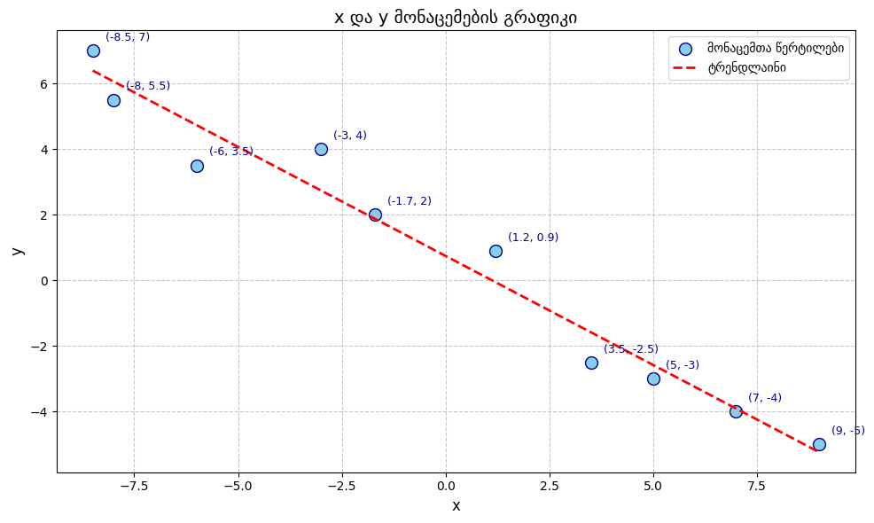
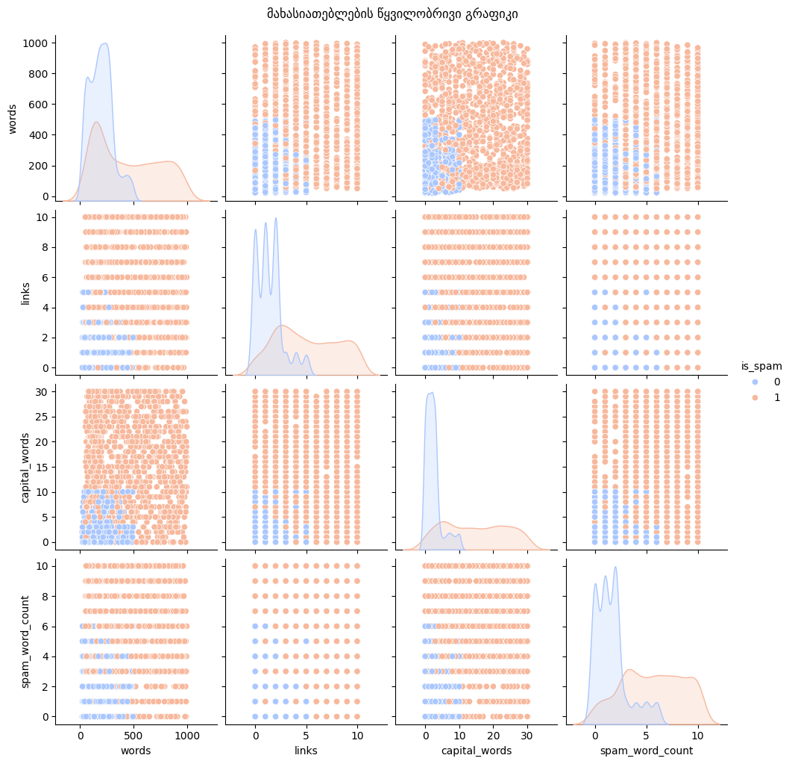
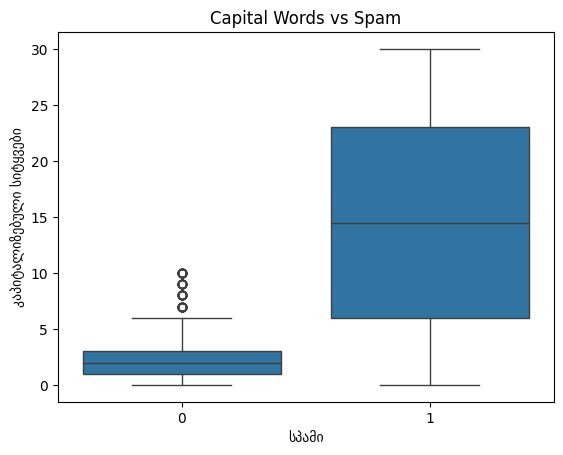

## 📘 README.md — შუალედური გამოცდა #1

**დავით დათუნაშვილი**  
**მანქანური სწავლება**  
**შუალედური გამოცდა #1**  
**თარიღი:** 23 აპრილი, 2025  
**ქულები:** სულ 20 ქულა  
**GitHub რეპოზიტორია:** [https://github.com/datunashvili/midterm_1](https://github.com/datunashvili/midterm_1)

**ნაშრომის ფაილი :** [🔗ნაშრომი](https://github.com/datunashvili/midterm_1/master/midterm_1.ipynb)

---

## 🔹 დავალება

---

### 1. 📊 კორელაციის მოძებნა (4 ქულა)

**მიზანი:** პირსონის კორელაციის კოეფიციენტის გამოთვლა ორ ცვლადს შორის.  
**გამოსახულება:**  
- გრაფიკი წერტილოვანი (scatter) ვიზუალიზაციით.
- წითელი ხაზით დანახული ტრენდლაინი.

**კოდის ბმული:** [correlation.py](🔗)

**აღწერა:**
- x და y ცვლადები დაკითხულია.
- გამოთვლილია მათი საშუალოები.
- პირსონის კოეფიციენტის ფორმულით გამოთვლილია კავშირი.
- გრაფიკზე წერტილოვანი განაწილება და ტრენდლაინი იძლევა ვიზუალურ წარმოდგენას.

**გრაფიკული გამოსახულება:**  


---

### 2. 📩 სპამ ელფოსტის გამოვლენა (16 ქულა)

---

#### 2.1. CSV ფაილის ატვირთვა (1 ქულა)

**ფაილი:** `daviti_datunashvili_1_62815392.csv`  
**ბმული GitHub-ზე:** [🔗 CSV ფაილი]([daviti_datunashvili_1_62815392.csv](https://github.com/datunashvili/midterm_1/master/daviti_datunashvili_1_62815392.csv))

---

#### 2.2. ლოგისტიკური რეგრესიის მოდელის შექმნა და გაწვრთნა (6 ქულა)

**კოდი:** [🔗ნაშრომი](https://github.com/datunashvili/midterm_1/master/midterm_1.ipynb)

- **მონაცემთა კითხვის კოდი:** გამოყენებულია `pandas.read_csv`.
- **მოდელი:** `sklearn.linear_model.LogisticRegression`.
- **გაწვრთნა:** მონაცემების 70% გამოყენებულია სწავლებისთვის, 30% ტესტისთვის.

**მოდელის კოეფიციენტები:**
```python
model.coef_
```
[ბეჭდავს თითო მახასიათებელზე გავლენას]

---

#### 2.3. მოდელის ტესტირება და აღრევის მატრიცა (2 ქულა)

**კოდი:** გამოიყენება `confusion_matrix` და `ConfusionMatrixDisplay`.

**მატრიცა:**
```
array([[368, 11],
       [ 18, 353]])
```

|                    | პროგნოზი: ლეგიტიმური | პროგნოზი: სპამი |
|--------------------|----------------------|-----------------|
| **რეალურად ლეგიტიმური** | TN = 368             | FP = 11         |
| **რეალურად სპამი**      | FN = 18              | TP = 353        |

**სიზუსტე (Accuracy):**
\[
Accuracy = \frac{368 + 353}{368 + 11 + 18 + 353} \approx 96.1\%
\]

---

#### 2.4. პროგრამა ტექსტის შესამოწმებლად (3 ქულა)

**კოდი:** [🔗ნაშრომი](https://github.com/datunashvili/midterm_1/master/midterm_1.ipynb)
- პროგრამა იღებს ელფოსტის ტექსტს.
- ითვლის სიტყვებს, ბმულებს, კაპიტალიზებულ სიტყვებს, სპამ სიტყვების რაოდენობას.
- აბრუნებს 0 ან 1 (ლეგიტიმური ან სპამი).

---

#### 2.5. სპამი ელფოსტის ტექსტი (1 ქულა)

```text
🔥 LIMITED TIME OFFER! CLICK HERE TO WIN A FREE iPHONE NOW!
```

**რატომ:**  
- იყენებს კაპიტალიზებულ სიტყვებს.
- შეიცავს სპამისთვის დამახასიათებელ trigger სიტყვებს ("FREE", "WIN", "CLICK").
- შეიცავს ბმულს და მაღალ ემოციურ სტილისტიკას.

---

#### 2.6. ლეგიტიმური ელფოსტის ტექსტი (1 ქულა)

```text
Dear Team,

I hope this message finds you well. Please find attached the meeting agenda for tomorrow. Let me know if you have any questions.

Best regards,  
David
```

**რატომ:**  
- ტექსტი არის საქმიანი.
- არ იყენებს სპამ სიტყვებს.
- დაბალი კაპიტალიზაცია და არანაირი ბმული.

---

#### 2.7. მონაცემთა ვიზუალიზაცია (2 ქულა)

**Pairplot:**
```python
sns.pairplot(df, hue='is_spam', palette='coolwarm')
```
- X და Y ღერძებზე მონაცმეები: words, links, capital_words, spam_word_count.
- სპამი და ლეგიტიმური ფერებით გამოყოფილია.

**Boxplot:**
```python
sns.boxplot(x='is_spam', y='capital_words', data=df)
```
- X ღერძი: is_spam (0 ან 1)
- Y ღერძი: capital_words
- აჩვენებს სპამში კაპიტალიზებული სიტყვების მაღალი რაოდენობას.

**გრაფიკული გამოსახულებები:**

- 
- 

---

## ✅ დასკვნა

- მოდელმა დააფიქსირა 96% სიზუსტე.
- მონაცემთა ანალიზმა და ვიზუალიზაციამ აჩვენა მნიშვნელოვანი კავშირები მახასიათებლებსა და ელფოსტების ტიპებს შორის.
- სპამისა და ლეგიტიმური ტექსტების გენერაციამ წარმატებით გამოავლინა მოდელის ქცევა სხვადასხვა სიტუაციაში.

